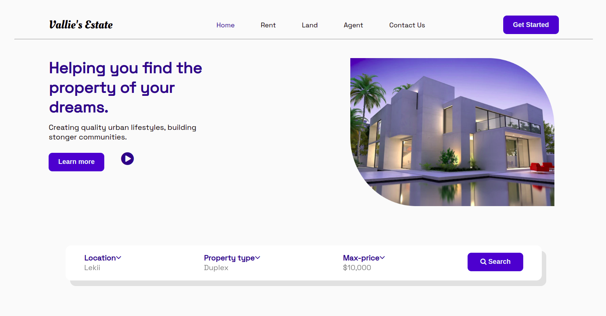
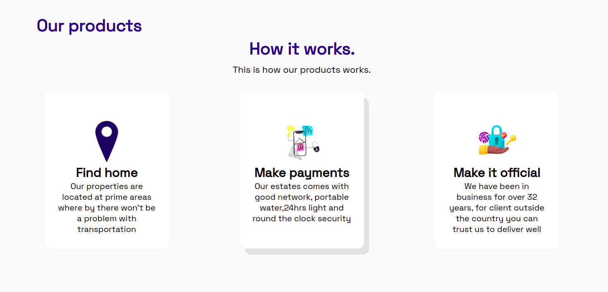

# VALLIES'S ESTATE
***

## Describtion
The Vallie's Estate website is a platform that provides clients from all corners of the world to locate house properties that meet their desires and at affordable prices.

## Demo
Use the link provided to navigate to the Vallie's estate website.
[Vallie's Estate](https://sheetabz.github.io/Vallies-Estate/)<br>

The page appears as shown below and has the following feaures:
- This the landingpage

- Other pages<br>


## Technologies used & Features
- Well designed and responsive UI
- HTML
- CSS

## Future-implementations 
- JavaScript
- Search APIs

## Contribution
If you need to contribute to this project follow the steps below:<br>
- Clone the repo(`git clone <repo link>`)
- Create a branch where you will add changes (`git branch -b <branchname>`)
- Add the changes (`git add .`)
- Commit changes (`git commit -m"contributing changes"`)
- Push your changes (`git push origin <branchname>`)

## Code Samples
```Html
 <div class="main main1">
            <div class="content">
                <div class="details" style=" margin-right: 400px;">
                    <h3>Helping you find the <br>property of your <br>dreams.</h3>
                    <p>Creating quality urban lifestyles, building <br>stonger communities.</p>
                </div>
                <div class="buttons2">
                    <button>Learn more</button>
                    <i style="font-size:40px; color: #0F298B;" class="fa">&#xf144;</i>
                </div>
            </div>
            <div class="image">
                
            </div>
        </div>
```
```Css
.main{
    width: 75%;
    margin: auto;
    display: flex;
    flex-direction: row;   
}
.main1{
    margin-top: 50px;
}
.details h3{
    font-size: 42px;
    color: #0F298B;
    font-weight: 600;
    margin-bottom: 15px;
}
.buttons2{
    background-clip: content-box;
}
```
### Author
[TABITHA MURIITHI](https://github.com/SheeTabz)

## license information.
### MIT License
[](https://opensource.org/licenses/MIT)  
`[](https://opensource.org/licenses/MIT)`


